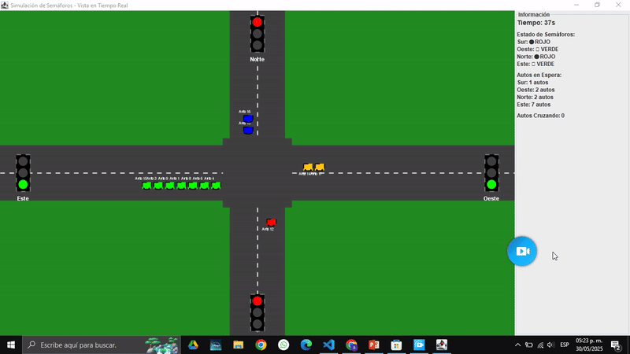

# 🚦 Simulación de Cruce Vehicular con Semáforos

Simulación de intersección vehicular controlada por semáforos utilizando programación concurrente en Java. Cada auto y semáforo funciona como un hilo independiente, coordinados mediante sincronización y exclusión mutua para prevenir colisiones y garantizar operación segura.

## 📸 Vista Previa

> Interfaz gráfica que muestra semáforos cambiando de color y autos avanzando según el estado del cruce.



---

## ⚙️ Tecnologías y Herramientas

- **Lenguaje:** Java
- **GUI:** Swing
- **Programación Concurrente:**
  - Hilos (`Thread`)
  - Exclusión mutua (`synchronized`)
  - Variables de condición (`wait()`, `notifyAll()`)

---

## 🧠 Conceptos Aplicados

- **Simulación multihilo:** Cada semáforo y auto opera como hilo independiente
- **Control de concurrencia:** Los autos verifican el estado del semáforo antes de avanzar
- **Exclusión mutua:** Protección del acceso a semáforos y cruce para evitar condiciones de carrera
- **Comunicación entre hilos:** Suspensión (`wait`) y reanudación (`notifyAll`) según estado del semáforo

---

## 📁 Estructura del Proyecto

```
├── App.java                    # Clase principal: inicia la simulación
├── Auto.java                   # Clase que representa cada auto (Thread)
├── AutoCruzando.java          # Representación del cruce en la GUI
├── ColorSemaforo.java         # Enum para los colores del semáforo
├── ControladorSemaforos.java  # Lógica del control de semáforos
├── Semaforo.java              # Clase con sincronización (mutex, wait/notify)
├── SemaforoGUI.java           # Lógica de la interfaz gráfica
└── SemaforoVisual.java        # Representación visual de cada semáforo
```

---

## 🚗 Funcionamiento

1. **Inicio:** La aplicación lanza hilos para semáforos y autos
2. **Semáforo:** Cambia de color automáticamente en intervalos regulares
3. **Autos:** Se detienen cuando el semáforo está en rojo (bloqueo con `wait()`)
4. **Cruce:** Controlado por exclusión mutua para prevenir colisiones
5. **GUI:** Actualización visual en tiempo real del sistema concurrente

---

## 🧪 Instalación y Ejecución

### Prerequisitos
- Java JDK 8 o superior
- Git

### Pasos
1. **Clonar el repositorio:**
   ```bash
   git clone https://github.com/AgustinCurilef/SimulacionSemaforos.git
   cd SimulacionSemaforos
   ```

2. **Compilar el proyecto:**
   ```bash
   javac *.java
   ```

3. **Ejecutar la simulación:**
   ```bash
   java App
   ```

---

## 🎯 Características Principales

- **Interfaz gráfica intuitiva** con Swing
- **Simulación en tiempo real** del comportamiento vehicular
- **Manejo seguro de concurrencia** sin deadlocks
- **Visualización dinámica** de estados de semáforos
- **Código modular y bien estructurado**

---

## 🔧 Detalles Técnicos

### Sincronización
- Uso de `synchronized` para proteger recursos compartidos
- Implementación de `wait()` y `notifyAll()` para comunicación entre hilos
- Control de acceso mediante exclusión mutua en el cruce

### Arquitectura
- Patrón Observer para actualización de la GUI
- Separación clara entre lógica de negocio y presentación
- Hilos independientes para cada componente del sistema

---

## 👨‍🎓 Información Académica

- **Autor:** Agustín Curilef
- **Institución:** Universidad de Río Negro
- **Materia:** Programación Concurrente
- **Año:** 2025

---

## 📝 Licencia

Este proyecto fue desarrollado con fines académicos para la materia de Programación Concurrente.

---

